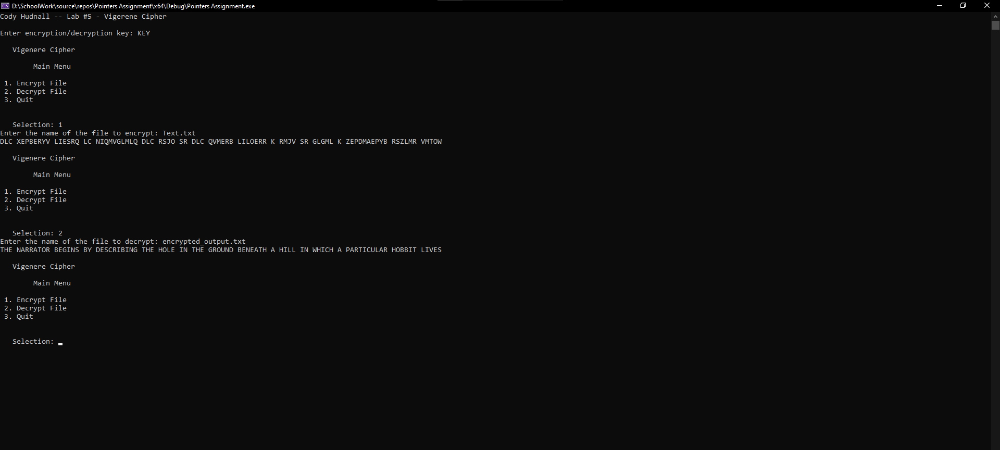

# Pointers Assignment - Vigenère Cipher

## Description
This project is a C++ implementation of a Vigenère Cipher encryption and decryption program. The program allows the user to encrypt or decrypt text files using a custom key entered at runtime. It demonstrates the use of pointers, tokenization, file processing, object-oriented programming, vectors, and string manipulation.

The program reads text from a file, processes each token individually using the Vigenère Cipher algorithm, and writes the results to output files.

## Features
- Encrypt text files using a custom key
- Decrypt encrypted files using the same key
- File input and output support
- Pointer-based tokenization using `strtok_s`
- Object-oriented program structure
- Menu-driven console interface
- Creates encrypted and decrypted output files

## Technologies Used
- C++
- Visual Studio
- File Streams
- Vectors
- Pointers
- String Manipulation

## Files Included
- `Main.cpp`
- `ProcessedMessage.cpp`
- `ProcessedMessage.h`
- `Vigenere.cpp`
- `Vigenere.h`
- `Text.txt`
- `encrypted_output.txt`
- `decrypted_output.txt`

## How to Run
1. Open the project in Visual Studio.
2. Build and run the program.
3. Enter an encryption/decryption key.
4. Choose:
   - Encrypt File
   - Decrypt File
   - Quit
5. Enter the file name when prompted.

Program output screenshot:

